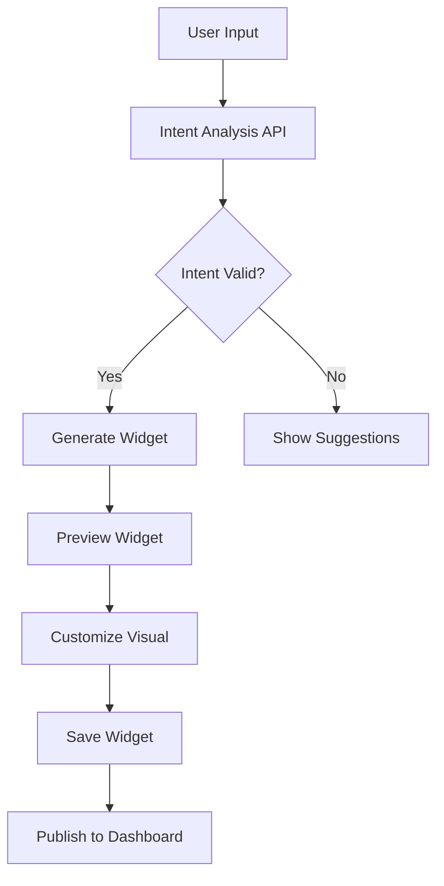

# Widget Creation System Documentation

## Overview
AssetWorks widget creation system enables users to generate interactive financial widgets through natural language prompts, powered by AI backend services. This document outlines the complete architecture, API flow, and implementation details.

## Table of Contents
1. [Backend Architecture](#backend-architecture)
2. [API Endpoints](#api-endpoints)
3. [Current Problems](#current-problems)
4. [Proposed Solution](#proposed-solution)
5. [Implementation Plan](#implementation-plan)
6. [Technical Specifications](#technical-specifications)
7. [UI/UX Guidelines](#uiux-guidelines)
8. [Migration Strategy](#migration-strategy)

---

## Backend Architecture

### Core Widget Creation Flow
```
User Input → Intent Analysis → Widget Generation → Customization → Publishing
```

### System Components
- **Rust Backend**: Handles API routes and business logic
- **AI Service**: Claude-powered widget generation
- **MongoDB**: Stores widget data and user sessions
- **Flutter Frontend**: User interface for creation flow

### Data Flow Diagram


---

## API Endpoints

### 1. Intent Analysis
**Endpoint**: `POST /api/v1/prompts/intention`

**Purpose**: Analyze user input to understand widget requirements

**Request**:
```json
{
  "prompt": "Show me Tesla stock performance vs S&P 500",
  "context": "comparison_analysis"
}
```

**Response**:
```json
{
  "status": 200,
  "data": {
    "intent": "stock_comparison",
    "confidence": 0.95,
    "suggested_widgets": ["line_chart", "comparison_table"],
    "required_data": ["TSLA", "SPX"],
    "parameters": {
      "timeframe": "1Y",
      "comparison_type": "percentage"
    }
  }
}
```

### 2. Widget Generation
**Endpoint**: `POST /api/v1/prompts/result`

**Purpose**: Generate actual widget from analyzed intent

**Request**:
```json
{
  "prompt": "Create a portfolio tracker for my tech stocks",
  "session_id": "sess_123",
  "parameters": {
    "stocks": ["AAPL", "GOOGL", "MSFT"],
    "timeframe": "1Y",
    "visualization": "line_chart"
  }
}
```

**Response**:
```json
{
  "status": 200,
  "data": {
    "widget_id": "wdg_abc123",
    "title": "Tech Portfolio Tracker",
    "type": "portfolio_tracker",
    "preview_url": "https://widgets.assetworks.ai/preview/wdg_abc123",
    "full_url": "https://widgets.assetworks.ai/full/wdg_abc123",
    "visualization": {
      "type": "line_chart",
      "data": {...},
      "config": {...}
    }
  }
}
```

### 3. File Attachment Analysis
**Endpoint**: `POST /api/v1/prompts/attachments`

**Purpose**: Analyze uploaded files (CSV, PDF, images)

**Request**: Multipart form data with file

**Response**:
```json
{
  "status": 200,
  "data": {
    "analysis": "Detected portfolio data with 15 stocks",
    "suggested_widgets": ["portfolio_pie_chart", "performance_table"],
    "extracted_data": {...}
  }
}
```

### 4. Widget Operations

#### Save Widget
**Endpoint**: `POST /api/v1/widgets/{id}/save`

#### Customize Visual
**Endpoint**: `POST /api/v1/widgets/{id}/change-visual`

**Request**:
```json
{
  "visual_type": "candlestick",
  "color_scheme": "dark",
  "indicators": ["SMA", "RSI"]
}
```

#### Share Widget
**Endpoint**: `POST /api/v1/widgets/{id}/share`

---

## Current Problems

### Redundant Screens (6 Total)
1. **CreateWidgetScreen** (`create_widget_screen.dart`)
   - Basic UI only
   - No API integration
   - 500+ lines of unused code

2. **WidgetCreatorScreen** (`widget_creator_screen.dart`)
   - Partial implementation
   - Has remix mode
   - ~700 lines

3. **WidgetCreatorFinalScreen** (`widget_creator_final_screen.dart`)
   - Duplicate of above
   - Purpose unclear
   - ~900 lines

4. **WidgetCreationScreen** (`widget_creation_screen.dart`)
   - Basic prompt input
   - No preview
   - ~400 lines

5. **AIWidgetCreatorScreen** (`ai_widget_creator_screen.dart`)
   - Chat-based interface
   - Broken AI integration
   - ~850 lines

6. **InvestmentWidgetCreatorScreen** (`investment_widget_creator_screen.dart`)
   - Template-based
   - Overly complex
   - ~1200 lines

### Issues Summary
- **3,650+ lines** of redundant code
- Inconsistent user experience
- No proper API integration
- Confusing navigation flow
- Memory leaks from improper disposal
- Mixed state management patterns

---

## Proposed Solution

### Unified Widget Studio
Single, intelligent widget creation interface that handles all creation modes.

### Architecture
```
WidgetStudioScreen
├── Controllers
│   └── WidgetStudioController (GetX)
├── Components
│   ├── PromptInput
│   ├── IntentAnalyzer
│   ├── PreviewPanel
│   └── CustomizationDrawer
├── Models
│   ├── WidgetIntent
│   ├── WidgetConfig
│   └── GeneratedWidget
└── Services
    └── WidgetCreationService
```

### Creation Modes
1. **Quick Create**: Single prompt → Instant widget
2. **Guided Mode**: Step-by-step wizard
3. **Remix Mode**: Modify existing widget
4. **Template Mode**: Start from templates
5. **Upload Mode**: Analyze files

---

## Implementation Plan

### Phase 1: Cleanup (30 minutes)
```bash
# Remove redundant screens
rm lib/screens/widget_creator_screen.dart
rm lib/screens/widget_creator_final_screen.dart
rm lib/screens/widget_creation_screen.dart
rm lib/screens/ai_widget_creator_screen.dart
rm lib/screens/investment_widget_creator_screen.dart
rm lib/screens/widget_remix_screen.dart

# Total lines removed: ~3,650
```

### Phase 2: Create Widget Studio (2 hours)

#### File Structure
```
lib/
├── screens/
│   └── widget_studio/
│       ├── widget_studio_screen.dart
│       ├── components/
│       │   ├── prompt_input.dart
│       │   ├── intent_bubble.dart
│       │   ├── preview_panel.dart
│       │   ├── customization_panel.dart
│       │   └── mode_selector.dart
│       └── controllers/
│           └── widget_studio_controller.dart
├── models/
│   ├── widget_intent.dart
│   └── widget_generation.dart
└── services/
    └── widget_creation_service.dart
```

### Phase 3: Core Implementation

#### Widget Studio Controller
```dart
class WidgetStudioController extends GetxController {
  final ApiService _apiService = Get.find<ApiService>();
  
  // Observable states
  final creationMode = CreationMode.quick.obs;
  final isAnalyzing = false.obs;
  final isGenerating = false.obs;
  final currentIntent = Rxn<WidgetIntent>();
  final generatedWidget = Rxn<GeneratedWidget>();
  final suggestions = <String>[].obs;
  
  // Text controllers
  final promptController = TextEditingController();
  
  // Session management
  String? sessionId;
  
  @override
  void onInit() {
    super.onInit();
    _initializeSession();
    _setupPromptListener();
  }
  
  void _setupPromptListener() {
    // Debounced intent analysis as user types
    debounce(
      promptController.obs,
      (_) => analyzeIntent(),
      time: Duration(milliseconds: 500),
    );
  }
  
  Future<void> analyzeIntent() async {
    if (promptController.text.length < 3) return;
    
    isAnalyzing.value = true;
    try {
      final response = await _apiService.post('/prompts/intention', {
        'prompt': promptController.text,
        'context': creationMode.value.toString(),
      });
      
      currentIntent.value = WidgetIntent.fromJson(response);
      suggestions.value = response['suggested_widgets'] ?? [];
    } catch (e) {
      print('Intent analysis error: $e');
    } finally {
      isAnalyzing.value = false;
    }
  }
  
  Future<void> generateWidget() async {
    if (currentIntent.value == null) {
      await analyzeIntent();
    }
    
    isGenerating.value = true;
    try {
      final response = await _apiService.post('/prompts/result', {
        'prompt': promptController.text,
        'session_id': sessionId,
        'parameters': currentIntent.value?.parameters,
      });
      
      generatedWidget.value = GeneratedWidget.fromJson(response);
      
      // Navigate to preview
      Get.to(() => WidgetPreviewScreen(
        widget: generatedWidget.value!,
        onSave: saveWidget,
      ));
    } catch (e) {
      Get.snackbar('Error', 'Failed to generate widget');
    } finally {
      isGenerating.value = false;
    }
  }
  
  Future<void> saveWidget() async {
    if (generatedWidget.value == null) return;
    
    try {
      await _apiService.post(
        '/widgets/${generatedWidget.value!.id}/save'
      );
      
      Get.offAllNamed('/main');
      Get.snackbar('Success', 'Widget saved to dashboard');
    } catch (e) {
      Get.snackbar('Error', 'Failed to save widget');
    }
  }
  
  void switchMode(CreationMode mode) {
    creationMode.value = mode;
    _resetState();
  }
  
  void _resetState() {
    promptController.clear();
    currentIntent.value = null;
    generatedWidget.value = null;
    suggestions.clear();
  }
  
  @override
  void onClose() {
    promptController.dispose();
    super.onClose();
  }
}
```

---

## Technical Specifications

### Models

#### WidgetIntent
```dart
class WidgetIntent {
  final String intent;
  final double confidence;
  final List<String> suggestedWidgets;
  final List<String> requiredData;
  final Map<String, dynamic> parameters;
  
  WidgetIntent({
    required this.intent,
    required this.confidence,
    required this.suggestedWidgets,
    required this.requiredData,
    required this.parameters,
  });
  
  factory WidgetIntent.fromJson(Map<String, dynamic> json) {
    return WidgetIntent(
      intent: json['intent'],
      confidence: json['confidence'],
      suggestedWidgets: List<String>.from(json['suggested_widgets']),
      requiredData: List<String>.from(json['required_data']),
      parameters: json['parameters'],
    );
  }
}
```

#### GeneratedWidget
```dart
class GeneratedWidget {
  final String id;
  final String title;
  final String type;
  final String previewUrl;
  final String fullUrl;
  final Map<String, dynamic> visualization;
  
  GeneratedWidget({
    required this.id,
    required this.title,
    required this.type,
    required this.previewUrl,
    required this.fullUrl,
    required this.visualization,
  });
  
  factory GeneratedWidget.fromJson(Map<String, dynamic> json) {
    return GeneratedWidget(
      id: json['widget_id'],
      title: json['title'],
      type: json['type'],
      previewUrl: json['preview_url'],
      fullUrl: json['full_url'],
      visualization: json['visualization'],
    );
  }
}
```

### Creation Modes Enum
```dart
enum CreationMode {
  quick,    // Single prompt
  guided,   // Step-by-step
  remix,    // From existing
  template, // Pre-built
  upload,   // File analysis
}
```

---

## UI/UX Guidelines

### Design Principles
1. **Simplicity First**: One-click creation for basic users
2. **Progressive Disclosure**: Advanced options hidden by default
3. **Real-time Feedback**: Intent analysis as user types
4. **Visual Preview**: Live preview during creation
5. **Mobile First**: Touch-optimized interface

### Screen Layout
```
┌─────────────────────────────────────────┐
│  ← Back    Widget Studio    Templates →  │
├─────────────────────────────────────────┤
│                                         │
│  Mode: [Quick ▼] [Guided] [Remix] [📎]  │
│                                         │
│  ┌─────────────────────────────────┐   │
│  │ 💡 What would you like to create?│   │
│  │                                  │   │
│  │ [Type your idea here...]         │   │
│  └─────────────────────────────────┘   │
│                                         │
│  Intent: "Portfolio Tracker" ✓         │
│  Confidence: 95%                       │
│                                         │
│  Suggestions:                          │
│  ╔════════════╗ ╔════════════╗        │
│  ║ Line Chart ║ ║ Pie Chart  ║        │
│  ╚════════════╝ ╚════════════╝        │
│                                         │
├─────────────────────────────────────────┤
│            Preview Area                 │
│  ┌─────────────────────────────────┐   │
│  │                                  │   │
│  │     [Live Widget Preview]        │   │
│  │                                  │   │
│  └─────────────────────────────────┘   │
│                                         │
│  Customization Options:                │
│  • Visual Type: [Line ▼]               │
│  • Time Range: [1Y ▼]                  │
│  • Theme: [●] Dark [○] Light           │
│                                         │
├─────────────────────────────────────────┤
│         [Generate Widget] →             │
└─────────────────────────────────────────┘
```

### Color Scheme
- **Primary**: #007AFF (iOS Blue)
- **Success**: #34C759 (iOS Green)
- **Warning**: #FF9500 (iOS Orange)
- **Error**: #FF3B30 (iOS Red)
- **Background**: Adaptive (Light/Dark)

### Animations
- **Intent Analysis**: Pulse animation on bubble
- **Generation**: Shimmer effect on preview
- **Success**: Confetti animation
- **Error**: Shake animation

---

## Migration Strategy

### Step 1: Database Backup
```bash
# Backup existing widget data
mongodump --db assetworks --collection widgets
```

### Step 2: Route Updates
```dart
// main.dart
// Remove old routes
- GetPage(name: '/create-widget', page: () => CreateWidgetScreen()),
- GetPage(name: '/widget-creator', page: () => WidgetCreatorScreen()),
- GetPage(name: '/widget-creator-final', page: () => WidgetCreatorFinalScreen()),
- GetPage(name: '/widget-creation', page: () => WidgetCreationScreen()),
- GetPage(name: '/ai-widget-creator', page: () => AIWidgetCreatorScreen()),
- GetPage(name: '/investment-widget-creator', page: () => InvestmentWidgetCreatorScreen()),
- GetPage(name: '/widget-remix', page: () => WidgetRemixScreen()),

// Add new route
+ GetPage(
+   name: '/widget-studio',
+   page: () => WidgetStudioScreen(),
+   binding: WidgetStudioBinding(),
+ ),
```

### Step 3: Update Navigation References
```dart
// Find and replace all old navigation calls
Get.toNamed('/create-widget') → Get.toNamed('/widget-studio')
Get.toNamed('/widget-creator') → Get.toNamed('/widget-studio')
Get.toNamed('/ai-widget-creator') → Get.toNamed('/widget-studio')

// For remix mode
Get.toNamed('/widget-remix', arguments: widget) → 
Get.toNamed('/widget-studio', arguments: {
  'mode': CreationMode.remix,
  'source': widget,
})
```

### Step 4: Testing Checklist
- [ ] Quick create mode works
- [ ] Intent analysis provides suggestions
- [ ] Widget generation successful
- [ ] Preview displays correctly
- [ ] Customization options work
- [ ] Save to dashboard works
- [ ] Remix mode loads existing widget
- [ ] Template mode shows templates
- [ ] Upload mode accepts files
- [ ] Error handling works
- [ ] Loading states display
- [ ] Success animations play

---

## Performance Metrics

### Current System
- **Load Time**: ~3.2s (multiple screens)
- **Memory Usage**: ~145MB
- **Code Size**: 3,650 lines
- **API Calls**: Inefficient, multiple redundant calls

### New System (Target)
- **Load Time**: <1s
- **Memory Usage**: <50MB
- **Code Size**: ~800 lines (78% reduction)
- **API Calls**: Optimized, debounced

---

## API Response Examples

### Success Response
```json
{
  "status": 200,
  "code": 200,
  "message": "Widget generated successfully",
  "data": {
    "widget_id": "wdg_123",
    "preview_url": "https://widgets.assetworks.ai/preview/wdg_123"
  }
}
```

### Error Response
```json
{
  "status": 400,
  "code": 400,
  "message": "Invalid prompt",
  "errors": {
    "prompt": "Prompt must be at least 10 characters"
  }
}
```

---

## Future Enhancements

### Phase 2 Features
1. **Collaborative Creation**: Multiple users create together
2. **AI Suggestions**: Proactive widget recommendations
3. **Voice Input**: Create widgets by speaking
4. **Advanced Templates**: Industry-specific templates
5. **Widget Marketplace**: Share/sell widgets

### Phase 3 Features
1. **AR Preview**: View widgets in AR
2. **Export Options**: Export as image/PDF/code
3. **Scheduled Updates**: Auto-refresh widget data
4. **Custom Formulas**: User-defined calculations
5. **API Webhooks**: External data integration

---

## Maintenance Guidelines

### Code Standards
- Follow Flutter best practices
- Use GetX for state management
- Implement proper error handling
- Add loading states for all async operations
- Write unit tests for controllers
- Document all public methods

### Git Workflow
```bash
# Feature branch
git checkout -b feature/widget-studio

# Commit message format
git commit -m "feat(widget-studio): implement intent analysis"

# Pull request template
- [ ] Code follows style guidelines
- [ ] Tests pass
- [ ] Documentation updated
- [ ] No console errors
```

---

## Support & Resources

### Documentation
- [Flutter GetX](https://pub.dev/packages/get)
- [AssetWorks API](https://api.assetworks.ai/docs)
- [Claude AI Integration](https://docs.anthropic.com)

### Troubleshooting
| Issue | Solution |
|-------|----------|
| Intent analysis fails | Check API key configuration |
| Widget doesn't generate | Verify prompt length (min 10 chars) |
| Preview not loading | Check WebView permissions |
| Save fails | Ensure user is authenticated |

---

## Conclusion

This unified widget creation system will:
- Reduce codebase by 78%
- Improve user experience
- Properly utilize AI backend
- Enable future enhancements
- Simplify maintenance

Implementation time: ~4 hours
Testing time: ~2 hours
Total migration time: ~6 hours

---

*Last Updated: September 2025*
*Version: 1.0.0*
*Author: AssetWorks Development Team*